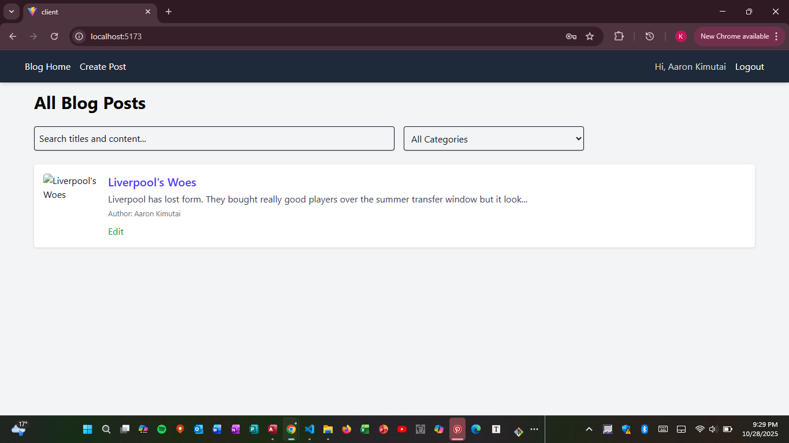
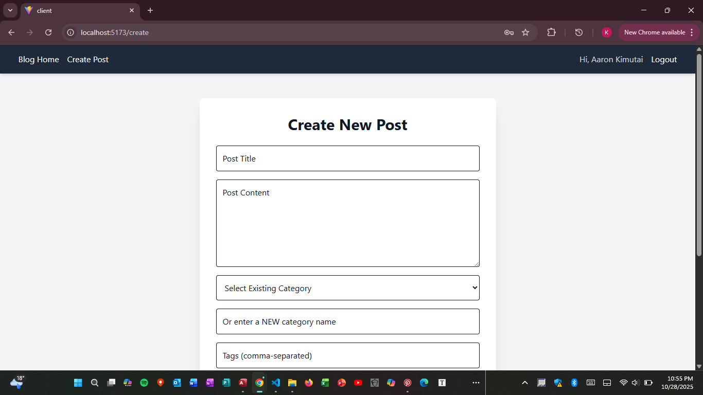
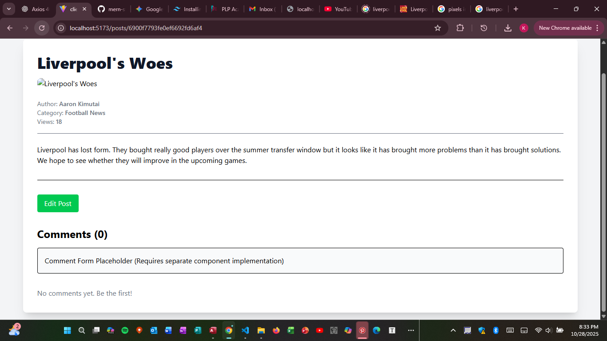

#  🚀 MERN Stack Deep Dive: Blog Application  
##  Project Overview  
This application serves as a comprehensive demonstration of full-stack integration using the MERN (MongoDB, Express.js, React.js, Node.js) stack.  
The project successfully fulfills the objective of building a robust blog platform with secure user authentication, file handling, and efficient data retrieval mechanisms.
##  ✨ Features Implemented  
This project fully integrates all required tasks and includes the following advanced features:  
### Authentication & Authorization
JWT Authentication:   
User registration (/register) and login (/login) are secured using JSON Web Tokens (JWTs).    
Protected Routes:   
Critical endpoints (POST, PUT, DELETE) are secured via server-side middleware (protect).  
Ownership Checks:   
Users can only modify or delete posts that they have authored.  
### Content Management & Scalability
Image Uploads:    
Implemented using Multer for handling multipart/form-data and storing featuredImage files in the server's /uploads directory.  
Dynamic Category Creation:  
 Users can input a new category name on the post form, and the backend automatically resolves and creates the category if it doesn't exist.    
 
Robust Lookup:  
 The single post retrieval (GET /api/posts/:id) is designed to look up content by either MongoDB _id or slug (Postman testing confirmed).  
 
Pagination, Search & Filter:  
The GET /api/posts endpoint is optimized to handle query parameters for page, limit, search, and category filtering.  
Comments Feature:   
Implemented the full backend logic (POST /api/posts/:id/comments) to allow authenticated users to add comments to a post.  
## 🛠️ Setup Instructions  
Follow these steps to clone your repository and run the client and server locally.    
### Prerequisites  
Node.js (v18+)  
npm (v9+)  
MongoDB (Running locally or accessible via MongoDB Atlas)  
### 1. Clone and Install Dependencies  
 
Accept the GitHub Classroom assignment invitation and clone the repository:    
git clone [YOUR_GITHUB_CLASSROOM_REPO_URL]  

#### Install server dependencies    
cd server  
`npm install` 

#### Install client dependencies  
cd ../client  
`npm install`  
### 2. Configure Environment Variables  
Create two files, .env and .env.example, in both the /server and /client directories:     
#### /server/.env.example  
```  
#### Database Connection String    
MONGO_URI=mongodb://localhost:27017/mern_blog_db    

#### JWT Secret Key for token generation and verification  
JWT_SECRET=YOUR_SECURE_RANDOM_SECRET_KEY  

PORT=5000  
```  

#### /client/.env.example# Base URL for the Express API.  
``` 
VITE_API_URL=http://localhost:5000/api  
```
### 3. Start Development Servers  
Run the following commands in separate terminal tabs:   
#### Terminal 1: Start Server (in /server directory)  
`npm run dev`

#### Terminal 2: Start Client (in /client directory)  
npm run dev  
The application will be accessible at http://localhost:5173.  
## 🗺️ API Endpoints Documentation  
| Endpoint                     | Method | Description                                               | Authentication      |
|-------------------------------|--------|-----------------------------------------------------------|-------------------|
| /api/auth/register            | POST   | Creates a new user account.                               | None              |
| /api/auth/login               | POST   | Authenticates user and returns JWT.                       | None              |
| /api/posts                    | GET    | Get all posts (supports page, limit, search, category).   | No                |
| /api/posts                    | POST   | Create a new blog post (Multipart/FormData).             | Required          |
| /api/posts/:id                | GET    | Get a specific post by ID or slug.                       | No                |
| /api/posts/:id                | PUT    | Update post data (includes optional image upload).       | Required (Author Only) |
| /api/posts/:id                | DELETE | Delete a post.                                           | Required (Author Only) |
| /api/posts/:id/comments       | POST   | Submits a new comment for the specified post.            | Required          |
| /api/categories               | GET    | Get a list of all category names and IDs.                | No                |

## 📸 Screenshots of the Application   
1. Post List View (Home Page)      
  
2. Create/Edit Post Form    
  
3. Single Post View    
  
